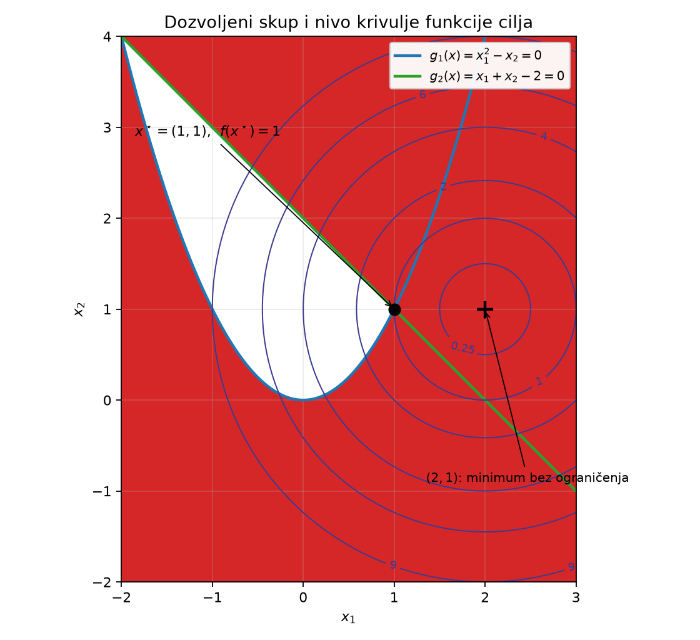

# 1. Uvod

> **Izvor:** `data/sources/01_Uvod.pdf`, stranice 1–79 (obrađeno u cijelosti).
>
> Napomena o izvoru: prezentacija je rađena u LaTeX Beameru, pa se većina slajdova
> pojavljuje u više „inkrementalnih” verzija (npr. str. 2–7 su isti slajd koji se
> gradi natuknicu po natuknicu). U ovoj skripti svaki takav niz je sažet u jedan
> potpuni odjeljak, ali **ni jedna natuknica nije izostavljena**.

---

## 1.1. Što je optimizacija? (str. 2–7)

**Etimologija.** Riječ *optimizacija* potječe od latinske riječi **„optimus”**, što
znači *najbolji*.

**Definicija (opisna, sa slajda).** Optimizacija sadrži skup aktivnosti čiji je cilj
pronaći **„najbolje rješenje”**, tzv. **optimum**, uz poštivanje zadanih **ograničenja**.

Uočite da su u toj rečenici već sadržana **tri** ključna sastojka svakog
optimizacijskog problema, i vrijedi ih odmah imenovati jer ćemo se na njih vraćati
kroz cijeli kolegij:

1. **Nešto se bira** — postoje veličine koje mi možemo mijenjati (npr. dimenzije
   konstrukcije, količina proizvedene robe, iznosi struja).
2. **Postoji mjerilo „najboljeg”** — moramo imati broj koji svakom izboru pridružuje
   ocjenu (cijena, masa, potrošnja…), inače riječ „najbolje” nema značenja.
3. **Ne smije se birati što god** — izbori moraju zadovoljiti ograničenja (npr. ne
   možemo proizvesti više nego što tvornica može, dimenzija ne može biti negativna).

**Optimizacija kao matematička disciplina.** Sa slajda:

> Optimizacija = matematička teorija i algoritmi („matematička mašinerija”) ne samo
> za donošenje najboljih odluka, već često i ključna za donošenje odluka općenito
> (izabrati najbolje rješenje od svih mogućih **vs.** da li uopće postoji rješenje).

Ta je zagrada važnija nego što se čini. Kod složenih inženjerskih problema često
uopće **nije očito postoji li ijedan izbor** koji zadovoljava sva ograničenja. Pitanje
„postoji li dopušteno rješenje?” je samo po sebi optimizacijski problem — i to ćemo
formalno riješiti već na kraju ovog poglavlja (odjeljak 1.12).

**Povijest.** Ljudi teže „optimiranju” od davnina, ali korijeni **moderne**
optimizacije smještaju se u vrijeme **2. svjetskog rata** — tada nastaju metode
*operacijskih istraživanja* (engl. *operations research*).

**Terminologija.** Pojam **„matematičko programiranje”** (engl. *mathematical
programming*) često se koristi kao sinonim za optimiranje. Odatle nam dolaze i imena
cijelih klasa problema koje ćemo obrađivati:

- *linear programming* (linearno programiranje, LP) → poglavlje 5,
- *nonlinear programming* (nelinearno programiranje),
- *quadratic programming* (kvadratno programiranje, QP) → poglavlje 5,
- … i tako dalje.

> ⚠️ Riječ „programiranje” ovdje **nema veze s računalnim programiranjem**. Potječe iz
> vojnog konteksta 1940-ih, gdje je „program” značio *plan/raspored* (npr. program
> opskrbe). To je uobičajen izvor zabune kod ljudi koji se prvi put susreću s temom.

**Jezična opaska sa slajda (str. 7).** Predavač posebno ističe riječ

> ~~najoptimalnije~~

Razlog: „optimalno” već znači *najbolje*. Ne postoji „optimalnije” ni
„najoptimalnije”, kao što ne postoji „najnajbolje”. Ispravno je reći **optimalno**.

---

## 1.2. Optimizacijski problem — standardna forma (str. 8–9)

Ovo je **središnja definicija cijelog kolegija**. Sve što slijedi u poglavljima 2–8
samo je razrada ovog zapisa.

### 1.2.1. Zapis s pojedinačnim ograničenjima (str. 8)

$$
\begin{aligned}
\text{minimiziraj} \quad & f(x) \\
\text{uz ograničenja} \quad & h_i(x) = 0, \quad i = 1,\dots,m \\
& g_j(x) \le 0, \quad j = 1,\dots,p
\end{aligned}
$$

### 1.2.2. Objašnjenje svakog simbola od nule

**Vektor projektnih varijabli $x$.**

$$
x = \begin{pmatrix} x_1 \\ x_2 \\ \vdots \\ x_n \end{pmatrix}
$$

- To su **projektne varijable** (engl. *decision variables*, hrv. i *varijable odluke*).
- Ovo su veličine koje **mi biramo** — one su „nepoznanice” problema.
- $n$ je broj tih veličina. Vektor $x$ je dakle stupac od $n$ realnih brojeva; pišemo
  $x \in \mathbb{R}^n$.
- Notacija $\mathbb{R}$ označava skup realnih brojeva, a $\mathbb{R}^n$ skup svih
  uređenih $n$-torki realnih brojeva. Npr. $\mathbb{R}^2$ je obična ravnina.

**Funkcija cilja $f$.**

$$
f : \mathbb{R}^n \to \mathbb{R}
$$

- Naziva se **funkcija cilja**, **ciljna funkcija** ili **kriterij** (engl.
  *objective function*, *cost function*).
- Zapis $f : \mathbb{R}^n \to \mathbb{R}$ čita se: „$f$ je funkcija koja uzima
  vektor iz $\mathbb{R}^n$ i vraća **jedan realan broj**”. Baš zato što vraća **jedan**
  broj, možemo dva različita izbora $x$ međusobno usporediti i reći koji je bolji.
- Konvencija je da **minimiziramo**. Ako želimo maksimizirati, koristimo trik iz
  odjeljka 1.12.

**Ograničenja jednakosti $h_i$.**

$$
h_i : \mathbb{R}^n \to \mathbb{R}, \quad i = 1,\dots,m
$$

- Engl. *equality constraints*.
- Uvjet $h_i(x) = 0$ mora biti zadovoljen **točno**, bez ikakvog odstupanja.
- Tipično dolaze iz fizikalnih zakona ili definicijskih veza (npr. „površina mora
  biti točno $A$”, „proizvodnja mora biti jednaka potrošnji”).
- $m$ je broj ograničenja jednakosti.

**Ograničenja nejednakosti $g_j$.**

$$
g_j : \mathbb{R}^n \to \mathbb{R}, \quad j = 1,\dots,p
$$

- Engl. *inequality constraints*.
- Uvjet $g_j(x) \le 0$ dopušta „rezervu”: dovoljno je da vrijednost ne prijeđe nulu.
- Tipično dolaze iz tehničkih ili resursnih ograničenja („naprezanje ne smije prijeći
  dopušteno”, „ne možemo proizvesti više od kapaciteta”).
- $p$ je broj ograničenja nejednakosti.

**Projektni prostor.** Općenito pišemo $x \in X$, gdje je $X$ **projektni prostor**.
U svemu što slijedi u ovom kolegiju bit će $X = \mathbb{R}^n$.

### 1.2.3. Kompaktni („vektorski”) zapis (str. 9)

Umjesto da nabrajamo ograničenja jedno po jedno, sve $h_i$ složimo u jedan vektorski
zapis, i isto za $g_j$:

$$
\begin{aligned}
\text{minimiziraj} \quad & f(x) \\
\text{uz ograničenja} \quad & h(x) = 0 \\
& g(x) \le 0
\end{aligned}
$$

gdje je sada

$$
h : \mathbb{R}^n \to \mathbb{R}^m, \qquad
h(x) = \begin{pmatrix} h_1(x) \\ \vdots \\ h_m(x) \end{pmatrix}, \qquad
g : \mathbb{R}^n \to \mathbb{R}^p, \qquad
g(x) = \begin{pmatrix} g_1(x) \\ \vdots \\ g_p(x) \end{pmatrix}
$$

> **Kako čitati $g(x) \le 0$ kad je $g(x)$ vektor?** Nejednakost između vektora ovdje
> se čita **po komponentama**: $g(x) \le 0$ znači $g_1(x) \le 0$ **i** $g_2(x) \le 0$
> **i** … **i** $g_p(x) \le 0$. Sve nejednakosti moraju vrijediti istovremeno.
> Nula na desnoj strani je nul-vektor odgovarajuće dimenzije.

### 1.2.4. Što je optimalno rješenje (str. 9)

**Definicija (sa slajda).** **Optimalno rješenje $x^\star$** je vektor projektnih
varijabli koji, od svih vektora iz projektnog prostora koji zadovoljavaju ograničenja,
ima **najmanju** vrijednost funkcije cilja $f$.

Uočite da definicija ima dva dijela i oba su nužna:

1. $x^\star$ mora **sam zadovoljavati ograničenja** (inače nije kandidat),
2. među svim takvim kandidatima ima **najmanji** $f$.

Zvjezdica $^\star$ je standardna oznaka za optimalnu vrijednost; koristit ćemo je kroz
cijelu skriptu ($x^\star$, $f(x^\star)$, kasnije $p^\star$, $\lambda^\star$, …).

### 1.2.5. Dozvoljeni skup (str. 78)

Skup svih $x$ koji zadovoljavaju **sva** ograničenja zove se **dozvoljeni skup** (ili
*dozvoljeno područje*, *dozvoljeni projektni prostor*; engl. *feasible set*):

$$
\boxed{\; \mathcal{F} = \{\, x \mid h(x) = 0, \; g(x) \le 0 \,\} \;}
$$

Notacija $\{\, x \mid \text{uvjet} \,\}$ čita se: „skup svih $x$ **takvih da** vrijedi
uvjet”. Uspravna crta $\mid$ znači „takvih da”.

Uz tu oznaku problem se piše najkraće:

$$
\min_{x \in \mathcal{F}} f(x)
$$

---

## 1.3. Uvodni primjer s potpunim grafom (str. 10–15)

Ovo je prvi konkretan problem u kolegiju i vrijedi ga proći vrlo pažljivo, jer se na
njemu vidi **sve** iz prethodnog odjeljka odjednom.

### 1.3.1. Postavka problema (str. 10)

$$
\begin{aligned}
\min_x \quad & (x_1 - 2)^2 + (x_2 - 1)^2 \\
\text{uz ograničenja} \quad &
\begin{cases}
x_1^2 - x_2 \le 0 \\
x_1 + x_2 \le 2
\end{cases}
\end{aligned}
$$

**Projektni prostor** (str. 10): $X = \mathbb{R}^n$ s varijablama $x = (x_1, x_2)$,
dakle $n = 2$.

### 1.3.2. Prepoznavanje elemenata standardne forme (str. 11–12)

**Dozvoljeni skup** (str. 11):

$$
\mathcal{F} = \{\, x \mid g(x) \le 0 \,\}, \qquad
g(x) = \begin{pmatrix} g_1(x) \\ g_2(x) \end{pmatrix}
= \begin{pmatrix} x_1^2 - x_2 \\ x_1 + x_2 - 2 \end{pmatrix} \le 0
$$

Obratite pažnju na **prebacivanje na standardnu formu**: ograničenje je zadano kao
$x_1 + x_2 \le 2$, a standardna forma traži oblik $g_j(x) \le 0$. Zato **oduzmemo 2 s
obje strane**:

$$
x_1 + x_2 \le 2 \quad \Longleftrightarrow \quad x_1 + x_2 - 2 \le 0
\quad \Longrightarrow \quad g_2(x) = x_1 + x_2 - 2
$$

Prvo ograničenje već je u pravom obliku: $g_1(x) = x_1^2 - x_2$.

**Funkcija cilja** (str. 12):

$$
f(x) = (x_1 - 2)^2 + (x_2 - 1)^2
$$

**Geometrijsko značenje funkcije cilja.** $f(x)$ je **kvadrat udaljenosti** točke
$x = (x_1, x_2)$ od točke $(2, 1)$. (Po Pitagorinu poučku, udaljenost je
$\sqrt{(x_1-2)^2 + (x_2-1)^2}$, a $f$ je taj izraz na kvadrat.) Dakle problem glasi:
**„nađi točku dozvoljenog skupa koja je najbliža točki $(2,1)$”**. Bez ograničenja
rješenje bi trivijalno bilo $x = (2,1)$ s $f = 0$; ograničenja to zabranjuju i zato
problem nije trivijalan.

### 1.3.3. Rješenje (str. 15)

$$
x^\star = \begin{pmatrix} x_1^\star \\ x_2^\star \end{pmatrix}
= \begin{pmatrix} 1 \\ 1 \end{pmatrix}, \qquad f(x^\star) = 1
$$

**Provjera da je $x^\star$ doista dozvoljena točka** (uvrštavanje korak po korak):

$$
g_1(x^\star) = (x_1^\star)^2 - x_2^\star = 1^2 - 1 = 1 - 1 = 0 \le 0 \quad \checkmark
$$

$$
g_2(x^\star) = x_1^\star + x_2^\star - 2 = 1 + 1 - 2 = 2 - 2 = 0 \le 0 \quad \checkmark
$$

Oba ograničenja su zadovoljena **s jednakošću** — kažemo da su **aktivna** u $x^\star$
(taj ćemo pojam formalno uvesti u poglavlju 3).

**Provjera vrijednosti funkcije cilja:**

$$
f(x^\star) = (1 - 2)^2 + (1 - 1)^2 = (-1)^2 + 0^2 = 1 + 0 = 1 \quad \checkmark
$$

### 1.3.4. Graf — upute za ručno crtanje korak po korak

Slajdovi 13, 14 i 15 grade upravo ovaj crtež u tri koraka: prvo ograničenje $g_1$,
zatim ograničenje $g_2$, pa oba zajedno s nivo krivuljama. Evo detaljnih uputa kako
ga nacrtati vlastitom rukom.

**Korak 1 — prazan koordinatni sustav.**
Nacrtajte vodoravnu os i označite je $x_1$, te okomitu os i označite je $x_2$.
Raspon kao na slajdu: $x_1$ od $-2$ do $3$, $x_2$ od $-2$ do $4$. Označite jedinice
na obje osi (cijeli brojevi). Koristite **jednako mjerilo** na obje osi — inače će
kružnice iz koraka 4 izgledati kao elipse i izgubit će se geometrijsko značenje.

**Korak 2 — prvo ograničenje $g_1$ (odgovara slajdu 13).**
Granica ograničenja $g_1$ je krivulja gdje vrijedi jednakost:

$$
g_1(x) = 0 \quad \Longleftrightarrow \quad x_1^2 - x_2 = 0
\quad \Longleftrightarrow \quad x_2 = x_1^2
$$

To je **obična parabola** s tjemenom u ishodištu $(0,0)$, otvorena prema gore.
Nacrtajte je kroz nekoliko točaka koje lako izračunate:

| $x_1$ | $-2$ | $-1$ | $0$ | $1$ | $2$ |
|---|---|---|---|---|---|
| $x_2 = x_1^2$ | $4$ | $1$ | $0$ | $1$ | $4$ |

*Koju stranu sjenčati?* Ograničenje traži $x_1^2 - x_2 \le 0$, tj. **$x_2 \ge x_1^2$**.
Dakle dopušteno je ono što je **iznad** parabole. Provjera testnom točkom: uzmimo
$(0, 1)$ — tada je $g_1 = 0^2 - 1 = -1 \le 0$ ✔, a točka $(0,1)$ leži iznad parabole.
Dakle: **osjenčajte (kao nedopušteno) područje ispod parabole**, a zadržite područje
iznad nje.

**Korak 3 — drugo ograničenje $g_2$ (odgovara slajdu 14).**
Granica je pravac:

$$
g_2(x) = 0 \quad \Longleftrightarrow \quad x_1 + x_2 - 2 = 0
\quad \Longleftrightarrow \quad x_2 = 2 - x_1
$$

Pravac s nagibom $-1$. Najlakše ga je nacrtati kroz dvije točke — sjecišta s osima:

- za $x_1 = 0$: $x_2 = 2$ → točka $(0, 2)$,
- za $x_2 = 0$: $x_1 = 2$ → točka $(2, 0)$.

Povucite pravac kroz te dvije točke.

*Koju stranu sjenčati?* Ograničenje traži $x_1 + x_2 - 2 \le 0$, tj.
**$x_2 \le 2 - x_1$**, dakle dopušteno je **ispod** pravca. Provjera testnom točkom:
ishodište $(0,0)$ daje $g_2 = 0 + 0 - 2 = -2 \le 0$ ✔, a ishodište je ispod pravca.
Dakle: **osjenčajte (kao nedopušteno) područje iznad pravca**.

**Korak 4 — odnos dviju krivulja i dozvoljeni skup.**
Parabola i pravac se sijeku ondje gdje vrijedi i $x_2 = x_1^2$ i $x_2 = 2 - x_1$:

$$
x_1^2 = 2 - x_1 \;\Longrightarrow\; x_1^2 + x_1 - 2 = 0
\;\Longrightarrow\; (x_1 + 2)(x_1 - 1) = 0
\;\Longrightarrow\; x_1 = -2 \;\text{ ili }\; x_1 = 1
$$

Pripadni $x_2$:

- za $x_1 = -2$: $x_2 = 2 - (-2) = 4$ → sjecište $(-2, 4)$,
- za $x_1 = 1$: $x_2 = 2 - 1 = 1$ → sjecište $(1, 1)$.

Dozvoljeni skup je presjek dvaju područja: **iznad parabole i ispod pravca**. To je
oblik **„leće”** (na slajdu bijelo područje) omeđen odozdo parabolom, a odozgo
pravcem, s vrhovima točno u dvjema sjecišnim točkama $(-2,4)$ i $(1,1)$. Sve ostalo
na crtežu je nedopušteno (na slajdu obojeno crveno).

**Korak 5 — nivo krivulje funkcije cilja (odgovara slajdu 15).**
**Nivo krivulja** (engl. *level curve*, *contour*) funkcije $f$ za razinu $c$ je skup
svih točaka u kojima $f$ ima **istu** vrijednost $c$:

$$
\{\, x \mid f(x) = c \,\}
$$

(Pojam ćemo detaljnije obraditi u odjeljku 2 i u Vježbama 1.) Ovdje:

$$
(x_1 - 2)^2 + (x_2 - 1)^2 = c
$$

To je **kružnica sa središtem u $(2,1)$ i polumjerom $\sqrt{c}$**. Nacrtajte nekoliko
koncentričnih kružnica oko točke $(2,1)$, npr. za

$$
c = 0.25 \;(r = 0.5), \quad c = 1 \;(r = 1), \quad c = 2 \;(r \approx 1.41),
\quad c = 4 \;(r = 2), \quad c = 9 \;(r = 3)
$$

Što je kružnica manja, to je vrijednost funkcije cilja manja — jer je $f$ kvadrat
udaljenosti od središta.

**Korak 6 — očitavanje optimuma.**
Označite točku $(2,1)$ (križić) — to bi bio minimum **da nema ograničenja**, ali ona
leži u crvenom (nedopuštenom) području: provjerimo, $g_1(2,1) = 2^2 - 1 = 3 > 0$ ✗.
Sada „napuhujte” kružnice od polumjera $0$ prema van i gledajte **koja prva dotakne
bijelu leću**. Ta prva dodirna točka je optimum. To je točno kružnica $c = 1$, a
dodiruje leću u vrhu $(1,1)$ — dakle $x^\star = (1,1)$, $f(x^\star) = 1$.

**Korak 7 — što graf znači.**
Optimum leži u **vrhu** dozvoljenog skupa, ondje gdje se sijeku obje granice, dakle
**oba ograničenja su aktivna**. Optimalna vrijednost $f(x^\star) = 1$ strogo je veća
od nule (vrijednosti neograničenog minimuma) — to je „cijena” koju plaćamo zato što
nas ograničenja tjeraju dalje od željene točke $(2,1)$. U poglavlju 3 naučit ćemo
algebarski uvjet (KKT uvjete) koji formalno opisuje upravo ovakvu situaciju.

**Konačni graf:**



> 📌 **Napomena o tiskarskoj pogrešci na slajdu 15.** Na slajdu 15 prvo ograničenje je
> otipkano kao $g_1(x) = x_1^2 - x^2 \le 0$, dok na slajdovima 10–14 svugdje piše
> $g_1(x) = x_1^2 - x_2 \le 0$. Ispravno je $x_1^2 - x_2$ — to potvrđuje i sam crtež
> na slajdu (parabola $x_2 = x_1^2$) i rješenje $x^\star = (1,1)$.

---

## 1.4. Gdje i zašto se optimira? (str. 16–17)

Slajdovi nabrajaju područja primjene; navodim ih u cijelosti jer daju osjećaj koliko
je pojam širok.

### 1.4.1. Optimiranje rada sustava / procesa („on-line”)

- Planiranje proizvodnje u elektroenergetskoj mreži
- Upravljanje motorom automobila
- Upravljanje tokovima snage i energijom u hibridnom automobilu
- Traženje najkraćeg puta (npr. GPS u autu, „preračunavam”)
- Gibanje robota prilikom obavljanja zadatka
- Plan bušenja rupa na ploči za elektroniku
- Web tražilica
- Optimalno upravljanje dinamičkim sustavima (bogata inženjerska/znanstvena grana za sebe)
- …

### 1.4.2. U fundamentalnim fizikalnim zakonima/problemima

- Traženje **ravnotežnog položaja** minimizacijom potencijalne energije
- **Stabilnost dinamičkih sustava** — traženje Ljapunovljeve funkcije

> Ove dvije stavke nisu samo ilustracija: prva se detaljno rješava u poglavlju 3
> (str. 62–68 tog predavanja), a druga je tema cijelog poglavlja 7.

### 1.4.3. U prirodi

- Oblik stabla (optimiranje oblika obzirom na vlastitu težinu i vanjska opterećenja)
- Struktura kosti
- Trajektorija šišmiša u lovu na plijen
- Oblik jabuke
- Prilagodba vrste na uvjete života u zadanoj okolini
- …

### 1.4.4. Optimalno projektiranje

- Optimalna raspodjela vjetroturbina u vjetroparku
- Optimiranje topologije, oblika, dimenzija mehanizama i nosivih konstrukcija —
  **u ovom kolegiju**
- …

… i još puno, puno toga.

---

## 1.5. Sadržaj kolegija i ishodi učenja (str. 18–32)

Kompletan popis tema sa slajdova (gradi se inkrementalno kroz 15 slajdova):

1. **Uvod**: Ciljevi kolegija i ishodi učenja.
2. **Optimizacijski problem**: definicije i klasifikacija. Konveksni opt. problemi.
3. **Uvjeti optimalnosti.** Geometrijska interpretacija i primjene.
4. **Lagrangeova dualnost**, alternative i analiza osjetljivosti.
5. **Linearno programiranje.** Pristupi rješavanju i primjeri.
6. **Kvadratno programiranje** s primjenama. Formulacija i značajke.
7. **Linearne matrične nejednadžbe i semidefinitno programiranje.**
8. **Numerički algoritmi** za rješavanje opt. problema (pregled).
9. **Optimiranje mehatroničkih sustava** — od linearnog do semidefinitnog
   programiranja: primjeri iz prakse.
10. **Formulacija stabilnosti i disipativnost dinamičkih sustava** kao opt. problema.
11. Formulacije kriterija i analiza učinkovitosti dinamičkih sustava.
12. Formulacije **optimalnog upravljanja** i pristupi rješavanju.
13. **Robusno optimiranje 1**
14. **Robusno optimiranje 2**
15. **Višeciljna optimizacija** i višeciljno upravljanje

**Kako se to preslikava na ovu skriptu:** teme 1–2 → poglavlja 1–2; tema 3 →
poglavlje 3; tema 4 → poglavlje 4; teme 5–6 → poglavlje 5; teme 7 i 9 → poglavlje 6;
teme 10–12 → poglavlje 7; teme 13–14 → poglavlje 8.

---

## 1.6. Motivacijski primjeri iz prakse (str. 33–43)

### 1.6.1. Planiranje proizvodnje u elektroenergetskoj mreži (str. 33–34)

**Problem:** planiranje rada električnih generatora.

Sa slajda, sa svrstavanjem svake stavke u element standardne forme:

| Sa slajda | Element opt. problema |
|---|---|
| tipično noć prije dana proizvodnje | (vremenski okvir odluke) |
| proizvodnja = predviđenoj potrošnji | **ograničenje jednakosti** $h(x)=0$ |
| minimiziranje troškova proizvodnje | **funkcija cilja** $f(x)$ |
| ograničenja na tok snage u dalekovodima | **ograničenja nejednakosti** $g(x)\le 0$ |
| planovi u slučaju kvara | **robusnost** (poglavlje 8) |

Dodatno (str. 34):

- Optimiranje (optimalno upravljanje) je **„skrivena tehnologija”** za razvoj
  naprednih mreža u budućnosti.
- Matematička formulacija tržišta i kreiranja tržišnih cijena: **Lagrangeova
  dualnost**.

> Zadnja rečenica je najava Vježbi 3, gdje se cijeli „Primjer 1: Tržište i formiranje
> cijena” rješava upravo preko dualnosti — vidi poglavlje 4 ove skripte.

### 1.6.2. Upravljanje tokovima snage i energijom u hibridnom automobilu (str. 35)

- Nije dobro imati napunjenu bateriju: želimo je (polu)praznu da bismo je mogli puniti
  prilikom kočenja (rekuperacija).
- **dobro → optimalno**
- Optimiranje je „skrivena tehnologija” koja daje „inteligenciju” procesu: pojmovi
  *dobro–loše* moraju biti vezani uz neki kriterij → **formalizacija funkcije cilja**.

### 1.6.3. Prediktivno upravljanje dinamičkim sustavima (str. 36–37)

Slajdovi su ilustracija koncepta MPC-a (engl. *Model Predictive Control*): u svakom
koraku se, na temelju modela, riješi optimizacijski problem na konačnom horizontu
predikcije, primijeni se prvi upravljački potez, pa se postupak ponovi. Detaljna
obrada je izvan opsega ovog uvodnog predavanja (teme 12 iz popisa).

### 1.6.4. Optimalno upravljanje — pozicioniranje glave tvrdog diska (str. 38)

Slajd prikazuje mehanizam tvrdog diska (ruka s glavom, *pivot*, *voice coil motor*
VCM) i regulacijsku petlju: regulator $K$ prima signal pogreške $e$ i daje upravljanje
$u$; $y_r$ je referenca, $y$ izlaz, $d$ poremećaj.

Podaci sa slajda: $>15000$ o/min, $12000$ traka na $1$ cm.

**Formulacija problema (sa slajda):**

$$
\min_K \; \max_{\|d\| \ne 0} \frac{\|e\|}{\|d\|}, \qquad
K \in \{\,\text{stabilizirajući regulatori}\,\}
$$

**Kako to čitati.** $\|\cdot\|$ je **norma** — mjera „veličine” signala (formalno u
Vježbama 1, odjeljak u poglavlju 2). Omjer $\|e\|/\|d\|$ je „koliko se poremećaj $d$
pojača u pogrešku $e$”. Unutarnji $\max$ uzima **najgori mogući** poremećaj, a
vanjski $\min$ bira regulator koji taj najgori slučaj čini što manjim. Ovakav
**min–max** zapis je tipičan za robusno projektiranje i vratit ćemo mu se u
poglavljima 7 i 8.

### 1.6.5. Ravnotežni položaj sustava u potencijalnom polju (str. 39–40)

**Postavka (str. 39).** Točka mase $m$ obješena je u vertikalnoj ravnini o dvije
elastične opruge zanemarive mase s konstantama $k_1, k_2$ i duljinama $l_1, l_2$,
dok je razmak objesišta jednak $d$.

Geometrija sa slajda: koordinatni sustav $(x, y)$; lijevo objesište je u ishodištu
$(0,0)$, desno objesište je na osi $x$ na udaljenosti $d$, tj. u $(d, 0)$; masa $m$
visi ispod, u točki $(x, y)$ (s $y < 0$). Lijeva opruga ima parametre $k_1, l_1$,
desna $k_2, l_2$.

**Zadatak:** izračunati ravnotežni položaj mase.

**Rješenje (str. 40).** Potencijalna energija mase $m$ u položaju $(x,y)$ je

$$
V(x,y) = mgy
+ \frac{k_1}{2}\left(l_1 - \sqrt{x^2 + y^2}\right)^2
+ \frac{k_2}{2}\left(l_2 - \sqrt{(d-x)^2 + y^2}\right)^2
$$

**Rastav izraza član po član** (svaki je član oblika „energija”):

- $mgy$ — **gravitacijska potencijalna energija** mase u polju sile teže
  ($g$ = ubrzanje sile teže). Budući da masa visi ispod osi $x$, $y$ je negativan pa
  je taj član negativan — spuštanjem mase energija pada.
- $\sqrt{x^2 + y^2}$ — trenutna **duljina lijeve opruge**, tj. udaljenost od
  objesišta $(0,0)$ do mase $(x,y)$ (Pitagorin poučak).
- $l_1 - \sqrt{x^2+y^2}$ — **deformacija** lijeve opruge (razlika nedeformirane
  duljine $l_1$ i trenutne duljine).
- $\frac{k_1}{2}(\cdot)^2$ — **elastična energija** lijeve opruge; standardna formula
  $E = \tfrac{1}{2}k\,\Delta l^2$.
- Analogno za desnu oprugu, samo je njezino objesište u $(d, 0)$, pa je udaljenost do
  mase $\sqrt{(d-x)^2 + y^2}$.

**Ravnotežna točka** $(x^\star, y^\star)$ je ona koja **minimizira** potencijalnu
energiju:

$$
(x^\star, y^\star) = \arg\min_{x,\,y} \; V(x,y)
$$

> **Notacija $\arg\min$.** $\min_x V(x)$ je **najmanja vrijednost** koju $V$ poprima
> (broj), dok je $\arg\min_x V(x)$ **argument** u kojem se taj minimum postiže (točka).
> Za nas je obično zanimljiv $\arg\min$ — želimo znati *gdje* je optimum, a ne samo
> *koliko* iznosi.

Ovo je važan konceptualni primjer: **fizikalni zakon (ravnoteža) izražen je kao
optimizacijski problem bez ograničenja.** Isti primjer se u poglavlju 3
(str. 62–68) proširuje na slučaj s ograničenjima i rješava preko uvjeta optimalnosti.

### 1.6.6. Primjeri iz prirode (str. 41)

Slajd je fotografska ilustracija tvrdnji iz odjeljka 1.4.3 (oblici koje priroda
„optimira”). Nema dodatnih formula.

### 1.6.7. Raspodjela vjetroturbina u vjetroparku (str. 42–43)

Slajd 43 prikazuje dva 3D grafa (površina prinosa nad tlocrtom parka, s ucrtanim
pozicijama turbina kao točkama i označenim smjerom sjevera **N**):

- lijevo: **optimalni položaji sa zanemarenim interakcijama preko vrtloga**,
- desno: **optimalni položaji s uračunatim interakcijama preko vrtloga**.

**Poanta:** ista funkcija cilja (ukupna proizvedena energija), ali bogatiji model
(uzimanje u obzir da turbina u vjetrenoj sjeni druge turbine daje manje) daje
**bitno drukčiji optimalni raspored**. Model ulazi u optimizaciju kroz ograničenja i
funkciju cilja — kvaliteta modela izravno određuje kvalitetu optimuma.

---

## 1.7. Primjer: problem proizvodnje i distribucije robe (str. 44–45)

Ovo je prvi potpuno formuliran „inženjersko-poslovni” problem u kolegiju i ujedno
prvi primjer **linearnog programa** (LP), koji ćemo formalno obraditi u poglavlju 5.

### 1.7.1. Opis problema (str. 44)

- Tvrtka ima **2 tvornice** i **7 trgovina**.
- U jednom proizvodnom vremenskom intervalu tvornica $i$ može proizvesti do $a_i$ tona.
- Svaka trgovina $j$ redovito ima potražnju od $b_j$ tona.
- Troškovi transporta od tvornice $i$ do trgovine $j$ su $c_{ij}$ kuna/toni.
- **Kako optimalno voditi tvrtku (minimizirati trošak)?**

### 1.7.2. Projektne varijable (str. 45)

$$
x_{ij} \in \mathbb{R}: \text{ koliko tvornica } i \text{ dobavlja robe trgovini } j,
\qquad x_{ij} \ge 0
$$

Budući da imamo $2$ tvornice i $7$ trgovina, ukupno je $2 \times 7 = 14$ varijabli.
Uvjet $x_{ij} \ge 0$ je fizikalne prirode: ne može se isporučiti negativna količina.

### 1.7.3. Potpuna formulacija (str. 45)

$$
\begin{aligned}
\min \quad & \sum_{i=1}^{2} \sum_{j=1}^{7} c_{ij} x_{ij} \\[4pt]
\text{uz ograničenja} \quad
& \sum_{j=1}^{7} x_{ij} \le a_i, \qquad i = 1, 2 \\[4pt]
& \sum_{i=1}^{2} x_{ij} \ge b_j, \qquad j = 1, \dots, 7 \\[4pt]
& x_{ij} \ge 0
\end{aligned}
$$

**Čitanje svakog retka:**

- **Funkcija cilja** $\sum_i \sum_j c_{ij} x_{ij}$: za svaku moguću relaciju
  tvornica → trgovina pomnožimo prevezenu količinu $x_{ij}$ [t] s jediničnim troškom
  $c_{ij}$ [kn/t] i sve zbrojimo. Rezultat je **ukupan trošak transporta** u kunama.
  (Simbol $\sum$ znači „zbroji po svim vrijednostima indeksa”; dvostruka suma znači
  da prolazimo po svim parovima $(i,j)$, dakle po svih 14 relacija.)
- **Kapacitet tvornice** $\sum_{j} x_{ij} \le a_i$: sve što tvornica $i$ pošalje
  (zbroj po svim trgovinama) ne smije prijeći njezin kapacitet $a_i$. Dva takva
  ograničenja (po jedno za svaku tvornicu).
- **Potražnja trgovine** $\sum_{i} x_{ij} \ge b_j$: sve što trgovina $j$ primi (zbroj
  po objema tvornicama) mora biti barem $b_j$. Sedam takvih ograničenja.
- **Nenegativnost** $x_{ij} \ge 0$: 14 ograničenja.

> **Prevođenje u standardnu formu iz odjeljka 1.2.** Standardna forma traži
> $g_j(x)\le 0$, pa nejednakost „$\ge$” pomnožimo s $-1$ (što okreće smjer):
> $\sum_i x_{ij} \ge b_j \Leftrightarrow b_j - \sum_i x_{ij} \le 0$, i
> $x_{ij} \ge 0 \Leftrightarrow -x_{ij} \le 0$. Kapacitet je već u pravom obliku nakon
> premještanja: $\sum_j x_{ij} - a_i \le 0$.

Uočite: i funkcija cilja i sva ograničenja su **linearne** funkcije varijabli
$x_{ij}$. To je definicija linearnog programa (poglavlje 5).

---

## 1.8. Klasični primjeri optimiranja s potpunim rješenjima (str. 46–52)

Slajdovi 46–52 rješavaju šest školskih ekstremalnih problema. Svi se rješavaju istim
receptom, pa ga vrijedi jednom izreći:

> **Recept (klasična analiza — traženje ekstrema funkcije jedne varijable).**
> 1. Uvedi varijablu i izrazi **funkciju cilja** preko nje.
> 2. Ako postoji ograničenje jednakosti, iz njega **izrazi jednu varijablu** i
>    **uvrsti** u funkciju cilja (eliminacija) — tako problem s ograničenjem postaje
>    problem bez ograničenja.
> 3. Deriviraj i izjednači s nulom: $\dfrac{\mathrm{d}F}{\mathrm{d}x} = 0$ →
>    **stacionarne točke**.
> 4. Provjeri drugom derivacijom: $F'' > 0$ → **minimum**, $F'' < 0$ → **maksimum**.
> 5. Izračunaj vrijednost cilja u nađenoj točki.
>
> Ovaj recept vrijedi za jednostavne, glatke probleme jedne varijable. U poglavlju 3
> generalizirat ćemo ga na više varijabli i na probleme gdje se ograničenja **ne mogu**
> tako lako eliminirati — tada nastupaju Lagrangeovi multiplikatori i KKT uvjeti.

### 1.8.1. Optimalno iskorištavanje materijala — posuda iz limene ploče (str. 46–47)

**Problem.** Iz kvadratne limene ploče stranice $a$ potrebno je izrezati uglove tako
da se iz preostalog dijela načini posuda što većeg volumena. Izrezuju se četiri
kvadratića stranice $x$ u uglovima; preostali „križ” se savine prema gore.

**Ciljna funkcija je volumen:**

$$
V = (a - 2x)^2 \cdot x
$$

*Odakle to:* nakon izrezivanja uglova stranice $x$ i savijanja, baza posude je kvadrat
stranice $a - 2x$ (s obje strane oduzimamo po $x$), a visina posude je $x$.

**Derivacija:**

$$
\frac{\mathrm{d}V}{\mathrm{d}x} = 12x^2 - 8ax + a^2
$$

*Provjera računa (raspis međukoraka koji na slajdu nije napisan):*

$$
V = x(a-2x)^2 = x(a^2 - 4ax + 4x^2) = a^2 x - 4a x^2 + 4x^3
$$
$$
\frac{\mathrm{d}V}{\mathrm{d}x} = a^2 - 8ax + 12x^2 \quad \checkmark
$$

**Izjednačavanje s nulom** daje kvadratnu jednadžbu $12x^2 - 8ax + a^2 = 0$, čija su
rješenja (sa slajda):

$$
x_{1,2} = \frac{a}{3} \pm \frac{a}{6}; \qquad x_1 = a/2, \quad x_2 = a/6
$$

*Provjera preko formule za kvadratnu jednadžbu:*

$$
x_{1,2} = \frac{8a \pm \sqrt{(8a)^2 - 4\cdot 12 \cdot a^2}}{2 \cdot 12}
= \frac{8a \pm \sqrt{64a^2 - 48a^2}}{24}
= \frac{8a \pm \sqrt{16a^2}}{24}
= \frac{8a \pm 4a}{24}
$$
$$
x_1 = \frac{12a}{24} = \frac{a}{2}, \qquad x_2 = \frac{4a}{24} = \frac{a}{6}
\quad \checkmark
$$

**Provjera drugom derivacijom:**

$$
V'' = \frac{\mathrm{d}^2 V}{\mathrm{d}x^2} = 24x - 8a
$$

$$
V''\!\left(\frac{a}{2}\right) = 24 \cdot \frac{a}{2} - 8a = 12a - 8a = 4a > 0
\;\to\; \textbf{min.}
$$

$$
V''\!\left(\frac{a}{6}\right) = 24 \cdot \frac{a}{6} - 8a = 4a - 8a = -4a < 0
\;\to\; \textbf{max.}
$$

**Vrijednosti:**

$$
V_{\max} = \left(a - \frac{a}{3}\right)^{2} \cdot \frac{a}{6} = \frac{2}{27}a^3;
\qquad V_{\min} = 0
$$

*Provjera:* za $x = a/6$ je $a - 2x = a - a/3 = \tfrac{2a}{3}$, pa je
$V = \left(\tfrac{2a}{3}\right)^2 \cdot \tfrac{a}{6}
= \tfrac{4a^2}{9}\cdot\tfrac{a}{6} = \tfrac{4a^3}{54} = \tfrac{2a^3}{27}$ ✔.
Za $x = a/2$ je $a - 2x = 0$, pa je $V = 0$ — geometrijski jasno: izrezali smo cijelu
ploču, baza je nestala.

### 1.8.2. Minimizacija troškova izgradnje — tlocrt kuće (str. 48)

**Problem.** Kuća ima 3 prostorije površine $A$ [m²]. Troškovi izgradnje vanjskih
zidova iznose $C$ [€/m], a troškovi za unutrašnje zidove iznose $2/3$ tih troškova.
Odrediti mjere tlocrta tako da troškovi izgradnje zidova budu minimalni.

Geometrija sa slajda: pravokutnik širine $x$ i visine $y$; unutar njega jedan okomiti
zid (duljine $y$) koji odvaja desni dio, te u lijevom dijelu vodoravni zid duljine
$2x/5$ — tako se dobiju 3 prostorije.

**Ograničenje jednakosti:**

$$
A = x\,y \; [\text{m}^2] \quad \to \quad y = A/x
$$

**Ciljna funkcija → minimalni troškovi:**

$$
F(x) = C\left(2x + 2\frac{A}{x}\right) + \frac{2}{3}C\left(\frac{2}{5}x + \frac{A}{x}\right)
$$

*Rastav:* prvi član su vanjski zidovi — opseg pravokutnika je $2x + 2y = 2x + 2A/x$,
uz cijenu $C$. Drugi član su unutarnji zidovi — vodoravni duljine $\tfrac{2}{5}x$ i
okomiti duljine $y = A/x$, uz cijenu $\tfrac{2}{3}C$.

**Sređivanje (sa slajda):**

$$
F(x) = \frac{2}{3}C\left(\frac{17}{5}x + 4\frac{A}{x}\right)
$$

*Raspis međukoraka koji na slajdu nije prikazan:*

$$
F(x) = 2Cx + \frac{2CA}{x} + \frac{2}{3}C \cdot \frac{2}{5}x + \frac{2}{3}C\frac{A}{x}
= C\underbrace{\left(2 + \frac{4}{15}\right)}_{= \frac{30+4}{15} = \frac{34}{15}}x
+ C\underbrace{\left(2 + \frac{2}{3}\right)}_{= \frac{6+2}{3} = \frac{8}{3}}\frac{A}{x}
$$
$$
= \frac{34}{15}Cx + \frac{8}{3}C\frac{A}{x}
$$

a s druge strane

$$
\frac{2}{3}C\left(\frac{17}{5}x + \frac{4A}{x}\right)
= \frac{2 \cdot 17}{3 \cdot 5}Cx + \frac{2\cdot 4}{3}C\frac{A}{x}
= \frac{34}{15}Cx + \frac{8}{3}C\frac{A}{x} \quad \checkmark
$$

**Konstante prebacimo na lijevu stranu** (jer konstantni pozitivni faktor ne mijenja
položaj minimuma — ovo je važan i često korišten trik, formaliziran u odjeljku 2 o
ekvivalentnim problemima):

$$
F_0 = \frac{3F(x)}{2C} = \left(\frac{17}{5}x + 4\frac{A}{x}\right)
$$

**Derivacija i izjednačavanje s nulom:**

$$
\frac{\mathrm{d}F_0}{\mathrm{d}x} = \frac{17}{5} - \frac{4A}{x^2} = 0
\quad \to \quad x^2 = \frac{20}{17}A = \frac{20}{17}xy
$$

*Međukorak:* iz $\tfrac{17}{5} = \tfrac{4A}{x^2}$ slijedi
$x^2 = \tfrac{4A \cdot 5}{17} = \tfrac{20A}{17}$; zatim se uvrsti $A = xy$.

**Odakle treba biti:**

$$
\frac{x}{y} = \frac{20}{17}
$$

*Međukorak:* iz $x^2 = \tfrac{20}{17}xy$ podijelimo obje strane s $x$ (dopušteno jer
$x > 0$) i dobijemo $x = \tfrac{20}{17}y$, tj. $x/y = 20/17$.

### 1.8.3. Maksimizacija volumena lijevka I (str. 49)

**Problem.** Neka se iz okrugle ploče izreže isječak tako da se iz ostatka načini
lijevak (stožac) što većeg volumena.

Geometrija: iz kruga polumjera $r$ izreže se kružni isječak kutom (ostatka) $\varphi$;
preostali dio se smota u plašt stošca. Nastali stožac ima polumjer baze $R$, izvodnicu
$r$ (jer je to polumjer polazne ploče) i visinu $h$.

**Polumjer baze (1):** duljina luka preostalog dijela postaje opseg baze:

$$
2R\pi = r\varphi \quad \to \quad R = \frac{r\varphi}{2\pi}
$$

**Visina stošca (2):** iz pravokutnog trokuta (izvodnica, polumjer baze, visina):

$$
h = \sqrt{r^2 - R^2}
$$

**Ciljna funkcija (3):** volumen stošca

$$
V = \frac{\pi R^2 h}{3}
$$

**Uvrštenjem (1) i (2) u (3):**

$$
V = \frac{r^3}{12\pi}\varphi^2 \sqrt{1 - \frac{\varphi^2}{4\pi^2}}
$$

*Raspis međukoraka:*

$$
R^2 = \frac{r^2\varphi^2}{4\pi^2}, \qquad
h = \sqrt{r^2 - \frac{r^2\varphi^2}{4\pi^2}} = r\sqrt{1 - \frac{\varphi^2}{4\pi^2}}
$$
$$
V = \frac{\pi}{3}\cdot\frac{r^2\varphi^2}{4\pi^2}\cdot r\sqrt{1 - \frac{\varphi^2}{4\pi^2}}
= \frac{r^3\varphi^2}{12\pi}\sqrt{1 - \frac{\varphi^2}{4\pi^2}} \quad \checkmark
$$

**Prebacivanjem konstanti na lijevu stranu i kvadriranjem, uređena ciljna funkcija je:**

$$
F(\varphi) = \left(\frac{12\pi V}{r^3}\right)^{2}
= \varphi^4\left(1 - \frac{\varphi^2}{4\pi^2}\right)
$$

> **Zašto smijemo kvadrirati?** Funkcija $t \mapsto t^2$ je **strogo rastuća** za
> $t \ge 0$, a $V \ge 0$. Strogo rastuća transformacija ne mijenja **položaj**
> maksimuma, samo njegovu vrijednost. Isto vrijedi za množenje pozitivnom konstantom.
> Ovaj postupak (uklanjanje korijena kvadriranjem) koristit ćemo često — vidi i
> Vježbe 2, gdje se isto radi s normama.

**Derivacija:**

$$
\frac{\mathrm{d}F}{\mathrm{d}\varphi} = 4\varphi^3 - \frac{3}{2\pi^2}\varphi^5 = 0
$$

*Provjera:* $F(\varphi) = \varphi^4 - \dfrac{\varphi^6}{4\pi^2}$, pa je
$F' = 4\varphi^3 - \dfrac{6\varphi^5}{4\pi^2} = 4\varphi^3 - \dfrac{3\varphi^5}{2\pi^2}$ ✔

**Iz toga slijedi:**

$$
\varphi^2 = \frac{8}{3}\pi^2 \quad \to \quad
\varphi = \sqrt{\frac{2}{3}}\cdot 2\pi \,\text{rad} = 293{,}939^\circ
$$

*Međukoraci:* podijelimo jednadžbu s $\varphi^3$ (za $\varphi \ne 0$):
$4 = \tfrac{3}{2\pi^2}\varphi^2$, dakle $\varphi^2 = \tfrac{8\pi^2}{3}$. Zatim
$\varphi = \sqrt{\tfrac{8\pi^2}{3}} = 2\pi\sqrt{\tfrac{2}{3}}$.
Brojčano: $\sqrt{2/3} = 0{,}8165$, pa $\varphi = 0{,}8165 \cdot 6{,}2832 = 5{,}1302$ rad;
u stupnjevima $5{,}1302 \cdot \tfrac{180}{\pi} = 293{,}94^\circ$ ✔

### 1.8.4. Maksimizacija volumena lijevka II (str. 50)

**Problem.** Kakav oblik treba imati lijevak (stožac) da kod **zadane površine plašta**
ima što veći volumen?

**Površina plašta:**

$$
A = 2\pi r \cdot R / 2 = \pi R r \quad \to \quad r = \frac{A}{\pi R}
$$

(Ovdje je $r$ izvodnica stošca, $R$ polumjer baze; formula za plašt stošca je
$A = \pi R r$.)

**Volumen:**

$$
V = \frac{\pi R^2}{3}\sqrt{r^2 - R^2}
= \frac{\pi R^2}{3}\sqrt{\frac{A^2}{\pi^2R^2} - R^2}, \qquad
V = \frac{R}{3}\sqrt{A^2 - \pi^2R^4}
$$

*Raspis zadnjeg koraka:* izlučimo $\tfrac{1}{\pi^2R^2}$ iz korijena:

$$
\sqrt{\frac{A^2}{\pi^2R^2} - R^2} = \frac{1}{\pi R}\sqrt{A^2 - \pi^2 R^4}
$$
$$
V = \frac{\pi R^2}{3}\cdot\frac{1}{\pi R}\sqrt{A^2 - \pi^2R^4}
= \frac{R}{3}\sqrt{A^2 - \pi^2R^4} \quad \checkmark
$$

**Volumen $V$ bit će maksimalan kad i $(3V)^2$**, pa je (isti trik kao u 1.8.3):

$$
F(R) = (3V)^2 = A^2R^2 - \pi^2R^6
$$

**Derivacija:**

$$
\frac{\mathrm{d}F}{\mathrm{d}R} = 2A^2R - 6\pi^2R^5 = 0 \quad \to \quad
A = \sqrt{3\pi^2R^4} = \pi\sqrt{3}\,R^2
$$

*Međukorak:* podijelimo s $2R$ ($R \ne 0$): $A^2 = 3\pi^2R^4$, pa korjenovanjem
$A = \pi R^2\sqrt{3}$.

**Iz $R^2 = \dfrac{A}{\pi\sqrt{3}}$ i $h^2 = r^2 - R^2 = \dfrac{A^2}{\pi^2R^2} - R^2$, slijedi:**

$$
\frac{h^2}{R^2} = 2 \quad \to \quad \frac{h}{R} = \sqrt{2}
$$

*Raspis:*

$$
\frac{h^2}{R^2} = \frac{1}{R^2}\left(\frac{A^2}{\pi^2R^2} - R^2\right)
= \frac{A^2}{\pi^2R^4} - 1
\overset{A^2 = 3\pi^2R^4}{=} \frac{3\pi^2R^4}{\pi^2R^4} - 1 = 3 - 1 = 2 \quad \checkmark
$$

**Zaključak:** optimalan lijevak ima omjer visine i polumjera baze $h/R = \sqrt{2}$.

### 1.8.5. Dimenzioniranje otvora vrata (str. 51)

**Problem.** Kako visoka moraju biti vrata tornja ($h$) da se ljestve duljine $L$ mogu
uvući u toranj?

Geometrija sa slajda: zid tornja je okomit; ljestve $\overline{AB} = L$ naslonjene su
tako da im donji kraj $B$ klizi po podu na udaljenosti $x$ od zida, a gornji kraj $A$
je uz vanjski zid; $a$ je debljina/odmak zida (vodoravna udaljenost od $A$ do brida
vrata), $y$ je visina na kojoj ljestve prelaze preko brida vrata, a $h$ je tražena
visina vrata.

**Rješenje:** traži se **maksimalna visina $y$ za vrijeme uvlačenja** ljestvi u toranj.

**Iz sličnosti trokuta (1):**

$$
\frac{y}{x-a} = \frac{\sqrt{L^2 - x^2}}{x}
\quad \to \quad
y = \frac{x-a}{x}\sqrt{L^2 - x^2}
\tag{1}
$$

(Ovdje je $\sqrt{L^2 - x^2}$ visina gornjeg kraja ljestvi $A$ nad podom — Pitagorin
poučak na trokutu s hipotenuzom $L$ i vodoravnom katetom $x$.)

**Derivacija i stacionarna točka (2):**

$$
\frac{\mathrm{d}y}{\mathrm{d}x} = \frac{aL^2 - x^3}{x^2\sqrt{L^2 - x^2}} = 0
\quad \to \quad x_{\mathrm m} = \sqrt[3]{aL^2}
\tag{2}
$$

*Međukorak:* razlomak je nula kad je brojnik nula: $aL^2 - x^3 = 0 \Rightarrow
x^3 = aL^2 \Rightarrow x = \sqrt[3]{aL^2}$.

**Uvrštenjem (2) u (1):**

$$
h \ge y_{\mathrm m} = \left[1 - \left(\frac{a}{L}\right)^{2/3}\right]^{3/2}\cdot L
$$

*Raspis uvrštavanja (na slajdu nije prikazan):* uz $x_{\mathrm m} = a^{1/3}L^{2/3}$,

$$
\frac{a}{x_{\mathrm m}} = \frac{a}{a^{1/3}L^{2/3}} = \frac{a^{2/3}}{L^{2/3}}
= \left(\frac{a}{L}\right)^{2/3}
$$
$$
\sqrt{L^2 - x_{\mathrm m}^2} = \sqrt{L^2 - a^{2/3}L^{4/3}}
= L\sqrt{1 - \left(\frac{a}{L}\right)^{2/3}}
$$
$$
y_{\mathrm m} = \left(1 - \frac{a}{x_{\mathrm m}}\right)\sqrt{L^2 - x_{\mathrm m}^2}
= \left[1 - \left(\tfrac{a}{L}\right)^{2/3}\right]
\cdot L\left[1 - \left(\tfrac{a}{L}\right)^{2/3}\right]^{1/2}
= L\left[1 - \left(\tfrac{a}{L}\right)^{2/3}\right]^{3/2} \quad \checkmark
$$

**Brojčani primjer sa slajda:**

$$
a = 2{,}7\,\text{m}; \quad L = 12{,}5\,\text{m}
\;\to\; y_{\mathrm m} = 6{,}4\,\text{m}; \quad x_{\mathrm m} = 7{,}5\,\text{m}
$$

*Provjera računa:*

$$
\frac{a}{L} = \frac{2{,}7}{12{,}5} = 0{,}216 = 0{,}6^3
\;\Rightarrow\; \left(\frac{a}{L}\right)^{2/3} = 0{,}6^2 = 0{,}36
$$
$$
y_{\mathrm m} = 12{,}5\,(1 - 0{,}36)^{3/2} = 12{,}5 \cdot 0{,}64^{3/2}
= 12{,}5 \cdot 0{,}8^3 = 12{,}5 \cdot 0{,}512 = 6{,}4\,\text{m} \quad \checkmark
$$
$$
x_{\mathrm m} = \sqrt[3]{2{,}7 \cdot 12{,}5^2} = \sqrt[3]{2{,}7 \cdot 156{,}25}
= \sqrt[3]{421{,}875} = 7{,}5\,\text{m} \quad \checkmark
$$

Slajd uz to prikazuje graf $y(x)$ za te brojke: krivulja kreće od nule pri $x = a = 2{,}7$,
raste do vrha $y \approx 6{,}4$ pri $x = 7{,}5$, i pada natrag na nulu pri $x = L = 12{,}5$
(tada su ljestve okomite uz zid).

### 1.8.6. Optimalna ograda (str. 52)

**Problem.** Površinu od 1 ha treba ograditi na način prema skici (pravokutnik
$x \times y$ s jednim unutarnjim pregradnim zidom duljine $y$). Troškovi postavljanja
ograde proporcionalni su duljini ograde. Odrediti dimenzije $x$ i $y$ tako da troškovi
budu minimalni.

**Ciljna funkcija je duljina ograde:**

$$
L = 2x + 3y \tag{1}
$$

*Odakle:* vanjski opseg je $2x + 2y$, a unutarnja pregrada je još jedan komad duljine
$y$; ukupno $2x + 3y$.

**Ograničenje je površina:**

$$
A = x\,y = 10\,000\,\text{m}^2 \quad \to \quad h = xy - 10\,000 = 0 \tag{2}
$$

(1 ha = 10 000 m². Zapis $h = xy - 10\,000 = 0$ je upravo standardna forma ograničenja
jednakosti iz odjeljka 1.2.)

**Uvrštenjem (2) u (1)**, tj. $y = 10\,000/x$, **ciljna funkcija postaje:**

$$
L = 2x + \frac{3 \cdot 10\,000}{x}
\quad \to \quad
\frac{\mathrm{d}L}{\mathrm{d}x} = 2 - \frac{30\,000}{x^2} = 0
$$

**pa je:**

$$
x_{\text{opt}} = 100\sqrt{\frac{3}{2}}, \qquad
y_{\text{opt}} = 100\sqrt{\frac{2}{3}}, \qquad
\left(\frac{x}{y}\right)_{\text{opt}} = \frac{3}{2}
$$

*Raspis:*

$$
2 = \frac{30\,000}{x^2} \;\Rightarrow\; x^2 = 15\,000
\;\Rightarrow\; x = \sqrt{15\,000} = \sqrt{10\,000 \cdot 1{,}5} = 100\sqrt{\tfrac{3}{2}}
\approx 122{,}47\,\text{m}
$$
$$
y = \frac{10\,000}{x} = \frac{10\,000}{100\sqrt{3/2}} = \frac{100}{\sqrt{3/2}}
= 100\sqrt{\tfrac{2}{3}} \approx 81{,}65\,\text{m}
$$
$$
\frac{x}{y} = \frac{100\sqrt{3/2}}{100\sqrt{2/3}} = \sqrt{\frac{3/2}{2/3}}
= \sqrt{\frac{9}{4}} = \frac{3}{2} \quad \checkmark
$$

**Interpretacija:** omjer stranica nije $1{:}1$ (kao kod običnog pravokutnika bez
pregrade) nego $3{:}2$ — jer pregradni zid „poskupljuje” smjer $y$, pa se isplati taj
smjer skratiti.

---

## 1.9. Vrste optimizacije konstrukcija (str. 53–56)

Ovo je klasifikacija specifična za strojarstvo/konstruiranje.

### 1. Dimenzionalna optimizacija (*Size optimization*) — str. 53

Optimiranje **dimenzija** objekata **poznate strukture i oblika**.

Primjeri:

- dimenzije elemenata nosivih konstrukcija (presjeci štapova, debljine limova, …)
- dimenzije članova mehanizama

### 2. Optimiranje oblika (*Shape optimization*) — str. 54

Osnovni **oblik** objekta mijenja se postupkom optimizacije ovisno o zadanim
parametrima problema (alat je često **FEM** analiza — metoda konačnih elemenata).

### 3. Topološka optimizacija (*Topology optimization*) — str. 55–56

Traži se optimalna **topologija (struktura)** konstrukcije u zadanoj domeni.

> Napomena: na slajdovima 55 i 56 topološka optimizacija je numerirana kao „2.”
> (očita tipfeler u prezentaciji — dvije uzastopne stavke nose broj 2). Sadržajno je
> to **treća** vrsta.

**Razlika u tri riječi:** *dimenzionalna* mijenja **brojeve** (koliko je štap debeo),
*oblikovna* mijenja **konture** (kako je rub zaobljen), *topološka* mijenja
**raspored materijala** (gdje uopće ima materijala, a gdje su rupe). Topološka je
najslobodnija i najteža.

---

## 1.10. Postavka problema (str. 57–58)

**Ključna poruka slajda 57:**

> Pravilna definicija, formulacija i točna matematička postavka optimizacijskog
> problema je često **najveći korak** prilikom rješavanja problema.
>
> Iz formulacije problema treba raspoznati o **kojoj se vrsti optimizacije radi**.

### 1.10.1. Jednostavan primjer koji to ilustrira (str. 57–58)

**Problem.** Površinu uz postojeću prirodnu ogradu (zid, stijena i sl.) treba ograditi
s raspoloživom duljinom žičane ograde $L$ tako da ograđena površina bude **maksimalna**.

Na slajdu su prikazana **tri oblika**:

- **a)** pravokutnik naslonjen na zid (jedna stranica $x$ uz zid, dvije stranice $y$),
- **b)** polukrug polumjera $r$ naslonjen na zid,
- **c)** pola pravilnog mnogokuta ($n$-terokut, konkretno $n = 8$) naslonjenog na zid.

**Poanta (sa slajda):**

> Iz gornje formulacije nije jasno da li se oblik ograde može odabrati po volji ili se
> postavljaju i neki drugi zahtjevi. Svaki od pokazanih oblika daje za istu duljinu
> ograde svoje rješenje, pri čemu se oblikom b) ograđuje **najveća** površina, a
> oblikom a) **najmanja**. Međutim, ako se radi o ogradi pašnjaka koju treba seliti
> duž zida, tada je oblik a) u „tehnološkoj” prednosti, jer se iskoristi sva
> raspoloživa površina.

**Zaključak:** ista rečenica („ogradi maksimalnu površinu”) daje **tri različita
optimizacijska problema**, ovisno o tome što smo prešutno pretpostavili. Zato je
formulacija najvažniji korak.

### 1.10.2. Brojčana usporedba triju oblika, $L = 500$ m (str. 58)

**Oblik b) — polukrug.**

$$
L = r\pi \;\to\; A = \frac{\pi r^2}{2} = \frac{L^2}{2\pi} = \frac{500^2}{2\pi}
= 39\,788{,}7\,\text{m}^2
$$

*Raspis:* iz $L = r\pi$ slijedi $r = L/\pi$, pa je
$A = \tfrac{\pi}{2}\cdot\tfrac{L^2}{\pi^2} = \tfrac{L^2}{2\pi}
= \tfrac{250\,000}{6{,}2832} = 39\,788{,}7$ m² ✔

**Oblik c) — polovica pravilnog $n$-terokuta, $n = 8$ (osmerokut).**

$$
L = \frac{n}{2}a \;\to\; \varphi = \frac{2\pi}{n}; \qquad
a = 2r\sin\frac{\varphi}{2} = 2r\sin\frac{\pi}{n}
$$

($a$ je duljina jedne stranice, $\varphi$ središnji kut nad jednom stranicom, $r$
polumjer opisane kružnice. Uz zid je polovica mnogokuta, pa ograda ima $n/2$ stranica.)

$$
r = \frac{L}{n \cdot \sin\frac{\pi}{n}}
$$

*Raspis:* iz $L = \tfrac{n}{2}a = \tfrac{n}{2}\cdot 2r\sin\tfrac{\pi}{n}
= n\,r\sin\tfrac{\pi}{n}$ slijedi $r = \tfrac{L}{n\sin(\pi/n)}$ ✔

$$
A = \frac{1}{2}a\,r\cos\frac{\varphi}{2}\cdot\frac{n}{2}
= \frac{n}{4}\cdot 2\frac{L}{n}\cdot\frac{L}{n\cdot\sin\frac{\pi}{n}}\cos\frac{\pi}{n}
= \frac{L^2}{2\,n \cdot \tan\frac{\pi}{n}}
$$

$$
A = \frac{500^2}{2 \cdot 8 \cdot \tan\frac{\pi}{8}} = 37\,722{,}1\,\text{m}^2
\qquad \left(\text{za } n \to \infty, \; \lim_{n\to\infty}\left(n\cdot\tan\frac{\pi}{n}\right) = \pi\right)
$$

*Provjera brojki:* $\tan(\pi/8) = \tan 22{,}5^\circ = 0{,}41421$, pa je
$2 \cdot 8 \cdot 0{,}41421 = 6{,}6274$ i $A = 250\,000/6{,}6274 = 37\,722$ m² ✔

*Značenje granice:* kad $n \to \infty$, $n\tan(\pi/n) \to \pi$, pa formula za
mnogokut prelazi u $A \to L^2/(2\pi)$ — točno rezultat polukruga b). Mnogokut s
mnogo stranica je praktički polukrug, što potvrđuje da je b) najbolji oblik.

**Oblik a) — pravokutnik.**

$$
L = x + 2y \;\to\; x = L - 2y \quad (\text{ograničenje jednakosti})
$$

$$
A = xy = (L - 2y)\,y; \qquad
\frac{\mathrm{d}A}{\mathrm{d}y} = L - 4y = 0 \;\to\;
y = \frac{L}{4} = 125\,\text{m}; \quad x = \frac{L}{2} = 250\,\text{m}
$$

*Raspis derivacije:* $A = Ly - 2y^2$, pa je $\tfrac{\mathrm{d}A}{\mathrm{d}y} = L - 4y$ ✔

$$
A = x\,y = 250 \cdot 125 = 31\,250\,\text{m}^2 \qquad (x : y = 2 : 1)
$$

**Rangiranje:** b) $39\,788{,}7$ > c) $37\,722{,}1$ > a) $31\,250$ m². Razlika između
najboljeg i najlošijeg oblika je oko **27 %** — a sve uz istu duljinu ograde. Odabir
*strukture* (oblika) donosi veći dobitak nego optimiranje *dimenzija* unutar zadane
strukture. To je uvod u sljedeći odjeljak.

---

## 1.11. Projektiranje kao proces (str. 59–77)

### 1.11.1. Slijed projektiranja (str. 59)

Projektiranje tehničkog sustava ostvaruje se u **dva koraka**:

1. **izbor strukture** sustava, odnosno **strukturalne sinteze**;
2. **izbor brojčanih vrijednosti parametara** odabrane strukture (sinteza parametara
   ili **dimenzionalna sinteza**).

> **Strukturalna sinteza** jest (glavni) zadatak **stvaralačkog djelovanja inženjera**
> koji je općenito teško ili nemoguće automatizirati (algoritmizirati).

To se izravno poklapa s primjerom ograde iz 1.10: odabir između oblika a), b), c) je
strukturalna sinteza (kreativni čin), a računanje $x = 250$, $y = 125$ je dimenzionalna
sinteza (algoritamski dio) — i baš je taj drugi dio ono što ovaj kolegij formalizira.

### 1.11.2. Strukturalna sinteza (str. 60)

Struktura projektiranog tehničkog sustava ili objekta (**topologija konstrukcije**)
određena je poznatim **skupom elemenata strukture** i **vezama među njima**.

**Poteškoće koje se pojavljuju u formalizaciji problema strukturalne sinteze:**

- nemjerljive karakteristike elemenata strukture;
- formalno nedefinirane veze između pojedinih elemenata i zahtjeva;
- kvalitativni kriteriji;
- neformalan opis funkcioniranja projektiranog objekta;
- zahtjevi koji se odnose na funkcioniranje objekta.

**Temelj sinteze tehničkih sustava jest:** skup znanja i iskustva projektanata,
intuicija, kreativnost, literatura, izvedeni projekti, sheme mogućih rješenja, metode
projektiranja, računalna i programska podrška.

Opis elemenata strukture, opis veza među njima kao i formiranje matematičkog modela
strukture definira se pomoću prikladnog (konačnog) skupa veličina: to su **projektni
parametri**.

### 1.11.3. Cilj projektiranja? (str. 61–67)

1. Gradnja sustava s besprijekornim funkcioniranjem se **danas podrazumijeva**.
2. U uvjetima konkurencije od presudne je važnosti projektirati **najbolji ili što
   bolji** sustav (objekt ili proizvod).
3. Kriteriji po kojima je neki sustav najbolji su različiti, primjerice: **cijena,
   težina, efikasnost, oblik, praktičnost, kompleksnost, originalnost, pouzdanost,
   trajnost** i sl.
4. **Izbor dominantnog kriterija** predstavlja **stratešku odluku** na početku samog
   procesa projektiranja. Kvaliteta rješenja ocjenjuje se **kvantitativnom** usporedbom
   odabranih kriterija, koji stoga moraju biti **funkcijom projektnih parametara**.
5. Izbor projektnih parametara najčešće **nije slobodan**, već njihove veličine moraju
   zadovoljiti neke unaprijed zadane uvjete ili **ograničenja**. Također trebaju biti
   ispunjeni uvjeti **međusobne ovisnosti** parametara koji slijede iz strukture
   projektiranog sustava.
6. Projektiranje je stoga **iterativni proces** određivanja strukture i projektnih
   parametara projektiranog sustava, konstrukcije ili proizvoda.
7. Konačnim projektnim rješenjem trebaju se ispuniti **svi** kriteriji i tehnički
   zahtjevi projekta.

> Točka 4 je zapravo definicija **funkcije cilja** rečena inženjerskim jezikom
> („kriterij mora biti funkcija projektnih parametara”), a točka 5 definicija
> **ograničenja**. Time se zatvara krug s odjeljkom 1.2.

### 1.11.4. Proces projektiranja (str. 68)

Prema primijenjenim metodama i projektnim zahtjevima proces projektiranja može biti:

**a) Proces konvencionalnog projektiranja.** Osnovni cilj: besprijekorno funkcioniranje
sustava ili proizvoda u okviru uvjeta postavljenih projektnim zadatkom (*funkcionalno
projektiranje*). Ovaj proces baziran je na **iskustvu i intuiciji**.

**b) Proces optimalnog projektiranja.**
Pored besprijekornog funkcioniranja sustava ili proizvoda, **jedan ili više projektnih
kriterija treba biti ispunjen na optimalan način**.
Postupak optimalnog projektiranja zahtijeva **strogu matematičku formulaciju problema**
— postavku matematičkog modela ili optimizacijskog problema.

### 1.11.5. Elementi optimizacijskog modela: projektni parametri i varijable (str. 69–70)

**Definicija.** **Projektni parametri** su veličine pomoću kojih se **jednoznačno
definiraju dimenzije i svojstva** konstrukcije ili projektiranog sistema.

Projektni parametri dijele se na **konstantne projektne parametre** i **projektne
varijable**.

**Konstantni projektni parametri** se u postupku optimizacije **ne mijenjaju**, a mogu
se podijeliti na dvije vrste:

- **taktički projektni parametri ($z$)** — zadani su **projektnim zadatkom** i ne mogu
  se mijenjati u cijelom procesu projektiranja. Oni su konstante strukturalne i
  dimenzionalne sinteze konstrukcije, tj. predstavljaju **taktičke performanse**
  projektiranog sustava.
- **tehnički projektni parametri ($y$)** — projektne su konstante **po zamisli
  projektanta**, i to prvenstveno iz **konstrukcijskih ili tehnoloških** razloga.

**Hijerarhija sa slajda 70 (dijagram):**

```
                      PROJEKTNI PARAMETRI
                     /                   \
        PROJEKTNE VARIJABLE        PROJEKTNE KONSTANTE
                x                        y,  z
                                       /        \
                          TEHNIČKI PARAMETRI   TAKTIČKI PARAMETRI
                                  y                    z
                        (odabrani od projektanta)  (zadani projektnim zadatkom)
```

**Dodatne tvrdnje sa slajda 70:**

- Tehnički parametri su konstante **samo kod dimenzionalne sinteze već poznate
  strukture (topologije)** objekta.
- Projektant može mijenjati broj tehničkih parametara njihovim **prebacivanjem u
  projektne varijable i obrnuto**.
- Projektni parametri koji se **mijenjaju** u postupku sinteze nazivaju se
  **projektnim varijablama ($x$)**.
- **Suma broja projektnih varijabli i tehničkih parametara** u postupku optimizacije
  iste strukture sistema je **konstantna**.
- Ispravan izbor projektnih parametara i odgovarajuća matematička formulacija problema
  glavne su poteškoće i preduvjeti uspješnog postupka optimalnog projektiranja.

> **Veza s odjeljkom 1.2:** vektor $x$ iz standardne forme = projektne varijable.
> Parametri $y$ i $z$ ne pojavljuju se kao nepoznanice, nego kao **brojevi** u
> izrazima za $f$, $h$ i $g$. U primjeru ograde (1.8.6): $x$ i $y$ (dimenzije) su
> projektne varijable, a $10\,000$ m² je taktički parametar (zadan zadatkom).

### 1.11.6. Optimizacijski model — pravila izbora parametara (str. 71–77)

Kod izbora projektnih parametara važno je sljedeće:

1. Projektant treba dobro **proučiti problem** i matematički ga opisati pomoću
   projektnih varijabli;
2. Projektni parametri trebaju biti **nezavisni**;
3. Problem treba opisati sa **što manje** projektnih parametara;
4. Matematičku formulaciju problema treba u **početnoj fazi** provesti sa **što manjim
   brojem tehničkih parametara**; to je važno radi fleksibilnosti algoritma i
   otklanjanja eventualnih pogrešnih procjena o utjecaju nekih tehničkih parametara na
   rezultat. U **kasnijoj fazi** mogu se neke od varijabli odabrati kao konstante, i to:
   - iz **konstrukcijskih ili tehnoloških** razloga;
   - jer je utvrđeno da **ne utječu bitno** na konačni rezultat optimizacije;
   - jer je utvrđeno da optimalno rješenje odgovara **uvijek vrijednosti neke varijable
     na rubu ograničenja**.

> **Zašto pravilo 2 (nezavisnost)?** Ako su dvije varijable povezane (npr. uvedemo i
> polumjer $r$ i promjer $d = 2r$), ograničenje $d = 2r$ postaje suvišna jednadžba, a
> problem numerički degenerira (rješenje nije jedinstveno u parametrima). Bolje je
> odabrati samo jednu od njih.
>
> **Zašto pravilo 3 (što manje parametara)?** Broj varijabli $n$ izravno određuje
> dimenziju prostora u kojem tražimo optimum i time složenost rješavanja.
>
> Zadnja alineja pravila 4 najavljuje pojam **aktivnog ograničenja** iz poglavlja 3:
> ako znamo da optimum uvijek leži na rubu, možemo tu nejednakost zamijeniti
> jednakošću i eliminirati varijablu.

---

## 1.12. Neki korisni „trikovi” (str. 79)

Ovaj slajd zatvara predavanje 1 i ponavlja se na početku predavanja 2 (str. 4–5), gdje
se i proširuje. Ovdje ga navodim u obliku iz predavanja 1.

### 1.12.1. Minimizacija ⇔ maksimizacija

$$
\begin{array}{ccc}
\begin{array}{l}
\max_x f(x) \\ \text{uz ogr.} \quad x \in \mathcal{F}
\end{array}
& \Longleftrightarrow &
\begin{array}{l}
\min_x -f(x) \\ \text{uz ogr.} \quad x \in \mathcal{F}
\end{array}
\end{array}
$$

**Zašto to vrijedi.** Ako $f$ postiže svoju **najveću** vrijednost u točki $x^\star$,
onda $-f$ u istoj toj točki postiže svoju **najmanju** vrijednost (jer množenje s $-1$
„okreće” os vrijednosti). Dakle:

- **argument** je isti: $\arg\max f = \arg\min (-f)$,
- **vrijednosti** su suprotne: $\max f = -\min(-f)$ — na to treba paziti kad
  izvještavate optimalnu vrijednost!

Zbog ovog trika **cijela teorija se može razviti samo za minimizaciju**, što i činimo
u standardnoj formi iz odjeljka 1.2.

### 1.12.2. Provjera je li dozvoljeni skup prazan (problem dopustivosti)

**Pitanje:** Je li skup $\mathcal{F} = \{\, x \mid g_i(x) \le 0,\; i = 1,\dots,p \,\}$
prazan? Ako nije, kako naći neki $x \in \mathcal{F}$?

**Rješenje:** riješi optimizacijski problem

$$
\begin{aligned}
\min_{x,\,t} \quad & t \\
\text{uz ograničenja} \quad & g_i(x) \le t, \quad i = 1,\dots,p
\end{aligned}
\tag{8}
$$

Neka je $t^\star, x^\star$ rješenje. **Ako je $t^\star \le 0$, tada $\mathcal{F}$ nije
prazan skup i $x^\star \in \mathcal{F}$.**

**Detaljno objašnjenje (jer je ideja lukavija nego što izgleda):**

- Uvodimo **novu, pomoćnu varijablu** $t \in \mathbb{R}$. Sada minimiziramo po paru
  $(x, t)$, dakle problem ima $n + 1$ varijablu umjesto $n$.
- Za **bilo koji** $x$ uvijek možemo naći dovoljno velik $t$ da svi uvjeti
  $g_i(x) \le t$ budu zadovoljeni (npr. $t = \max_i g_i(x)$). Zato **novi problem
  nikad nije nedopustiv** — uvijek ima rješenje, za razliku od polaznog.
- Funkcija cilja je samo $t$: guramo $t$ što niže. Za fiksni $x$ najmanji dopušteni
  $t$ je točno $\max_i g_i(x)$ — „najgore prekršeno ograničenje”. Dakle problem (8)
  zapravo rješava

  $$
  \min_x \; \max_{i} \; g_i(x)
  $$

  tj. traži $x$ koji **najmanje krši najgore ograničenje**.
- **Ako je $t^\star \le 0$:** tada je $g_i(x^\star) \le t^\star \le 0$ za sve $i$,
  dakle $x^\star$ zadovoljava **sva** izvorna ograničenja → $x^\star \in \mathcal{F}$
  i skup nije prazan. Bonus: dobili smo i konkretnu dopuštenu točku.
- **Ako je $t^\star > 0$:** ne postoji nijedan $x$ za koji su sva $g_i(x) \le 0$
  (jer bi za takav $x$ vrijednost $t = 0$ bila dopuštena i dala manji cilj od
  $t^\star$) → $\mathcal{F}$ **je prazan**.

> Ovaj se postupak zove **faza I** (engl. *phase I*) i standardni je prvi korak svakog
> ozbiljnog optimizacijskog algoritma: prije nego što tražimo *najbolju* dopuštenu
> točku, moramo naći *bilo koju*. Uočite i tehniku: **uvođenje pomoćne varijable koja
> „gura” min–max u obični min** — istu ćemo tehniku sresti kod norma (Vježbe 2) i kod
> robusnog optimiranja (poglavlje 8).

---

## 1.13. Sažetak poglavlja 1

**Što morate znati napamet nakon ovog poglavlja:**

1. **Standardna forma:** $\min f(x)$ uz $h(x) = 0$, $g(x) \le 0$; što je $x$, $f$,
   $h$, $g$, i što je dozvoljeni skup $\mathcal{F} = \{x \mid h(x)=0,\, g(x)\le 0\}$.
2. **Definicija optimalnog rješenja** $x^\star$ (dopustivo **i** najmanji $f$).
3. **Nivo krivulja** $\{x \mid f(x) = c\}$ i kako se iz slike nivo krivulja + dozvoljenog
   skupa očita optimum (uvodni primjer, odjeljak 1.3).
4. **Prevođenje u standardnu formu:** premještanje konstante na lijevu stranu, okretanje
   „$\ge$” množenjem s $-1$, $\max f \Leftrightarrow \min(-f)$.
5. **Recept klasične analize** (eliminacija ograničenja jednakosti uvrštavanjem +
   $F' = 0$ + provjera s $F''$) — i svijest da on ne funkcionira općenito, zbog čega
   nam trebaju poglavlja 3 i 4.
6. **Problem dopustivosti** (8) i njegova interpretacija.

**Terminologija (hrvatski ↔ engleski):**

| Hrvatski | Engleski |
|---|---|
| projektne varijable / varijable odluke | decision variables |
| funkcija cilja / ciljna funkcija | objective function |
| ograničenja jednakosti | equality constraints |
| ograničenja nejednakosti | inequality constraints |
| dozvoljeni skup / dozvoljeno područje | feasible set |
| nivo krivulja | level curve / contour |
| dimenzionalna optimizacija | size optimization |
| optimiranje oblika | shape optimization |
| topološka optimizacija | topology optimization |

---

**Sljedeće poglavlje:** [02 — Definicije, klasifikacija, konveksnost](02-definicije-klasifikacija-konveksnost.md)
